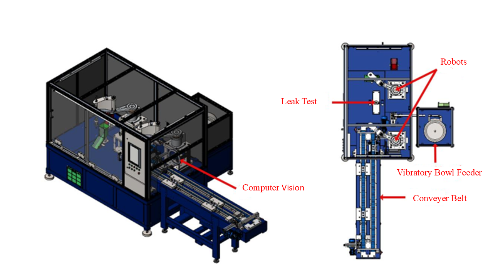
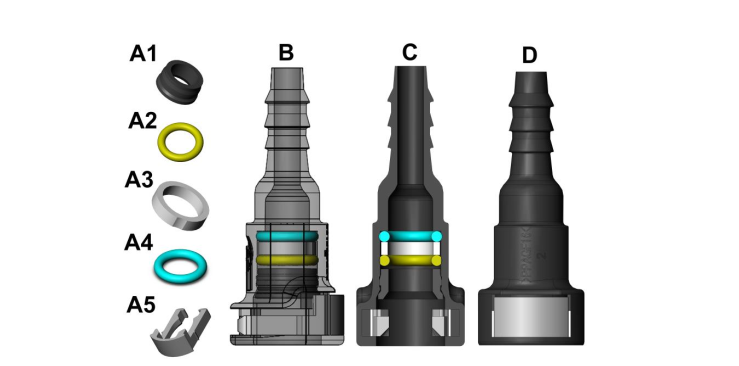

# Connector Assembly Robot Project

## Overview
The Connector Assembly Robot project integrates mechanical, electrical, and computer vision systems to automate and streamline the assembly process. The computer vision algorithms were developed using QT and C++ to ensure the correct placement of rings and connectors.

## Images & Videos

### 1. Connector Assembly Robot Overview

### 2. Connector and ring structure

### 3. Video of the Assembly Process
  
*Click on the image to watch the video demonstrating the assembly process using the Connector Assembly Robot.*

## How It Works
The computer vision system ensures that the correct order, color, and shape of rings and connectors are placed on the carrier. Failed images are stored in memory for further analysis.

